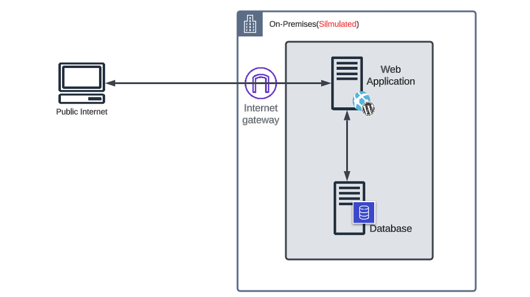
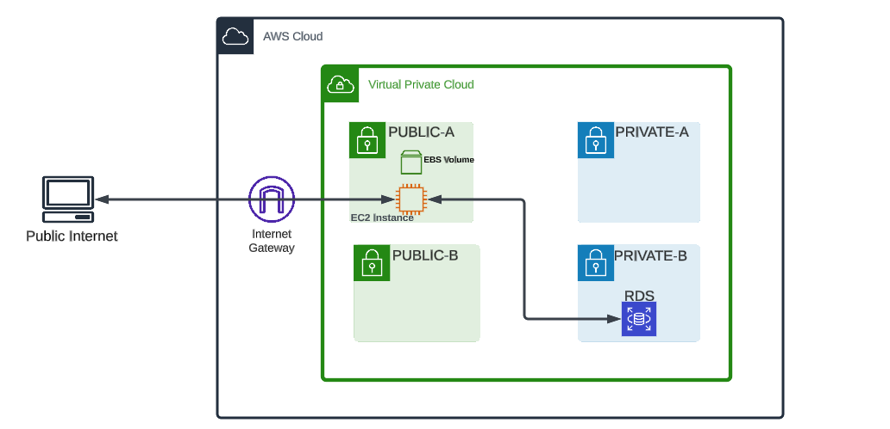
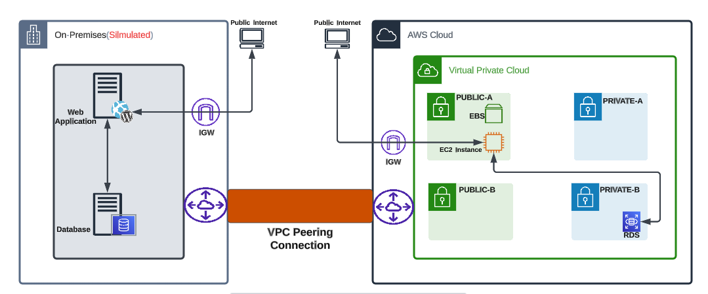
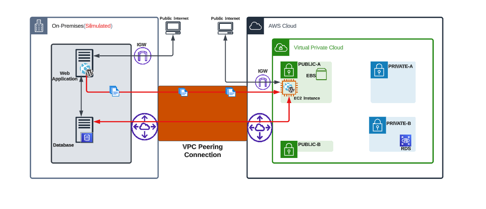
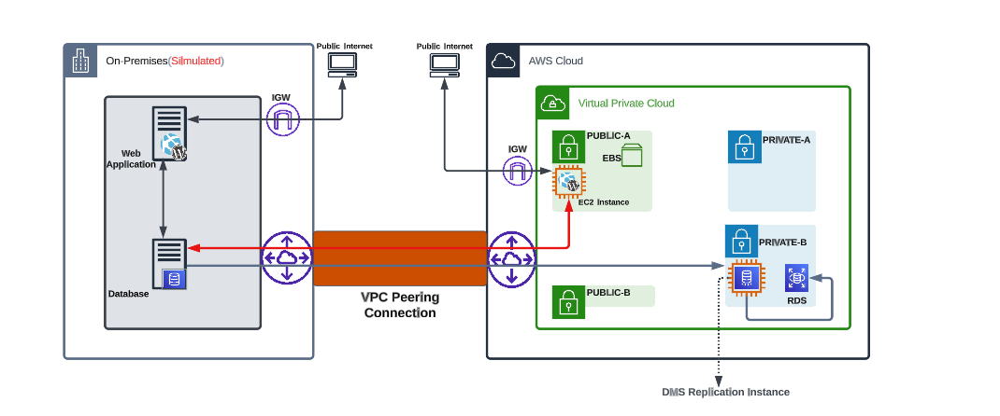
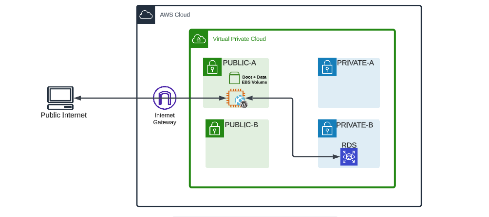

# Database-Migration-using-DMS

## Introduction

In this repository, we are going to explore the architecture and migration procedure of a simple WordPress application from a simulated on-premises setup to Amazon Web Services (AWS). The migration process involves transferring WordPress content, adjusting permissions, and verifying the functionality of the website on AWS using a VPC peering connection established to enable communication between the on-premises network and AWS. Additionally, the Database Migration Service (DMS) is utilized for data migration from the on-premises database to the AWS database. Lastly, the steps to complete the cutover process for application migration to AWS are described, ensuring a successful transition of the application to the new environment.

## SIMULATED ON-PREM ARCHITECTURE

The WordPress application is hosted on an Amazon Linux t2.micro instance within the on-prem VPC, configured with a /24 CIDR range. This instance provides computing capacity for running the application, with its assigned IPv4 address facilitating communication. Positioned within a public subnet, it benefits from internet connectivity, allowing users worldwide to access the WordPress site. To ensure secure access, the instance is configured with a dedicated security group that allows inbound traffic on TCP port 80 for HTTP from any source on the internet, enabling access to web services hosted on the instance.

The MariaDB database, powering the on-prem WordPress application, is hosted on an EC2 instance within the same public subnet. Similar to the WordPress instance, the EC2 instance hosting the database possesses an IPv4 address for communication. To establish secure communication between the WordPress application and the MariaDB database, a security group is assigned to the database  EC2 instance, allowing inbound TCP traffic on port 3306 from anywhere on the internet. This configuration ensures efficient storage and retrieval of data for the WordPress application.

Routing and the internet gateway play a crucial role in enabling communication with external resources. A route table associated with the public subnet directs traffic to and from the internet using an Internet Gateway (IGW). Through the IGW, instances within the subnet can communicate with resources outside the VPC, allowing internet users to access the WordPress site. Proper configuration of the route table ensures secure and seamless inbound and outbound traffic flow for the instances.

To grant the WordPress application specific permissions and fine-grained access control, we utilize an IAM role. This role defines the precise privileges the application holds within the AWS environment. Additionally, the IAM role is configured to enable the application to access required parameters stored in the AWS Parameter Store. The AWS Parameter Store serves as a centralized and secure repository for web application configurations, ensuring streamlined management and retrieval of crucial parameters for the WordPress application.

## AWS ARCHITECTURE

The architecture on AWS consists of an Amazon Linux t2.micro instance within a Virtual Private Cloud(VPC), configured with a /16 CIDR range. The instance will be assigned an IPv4 address for communication purposes and will reside in a public subnet within the VPC.

For secure access and administration, a security group will be associated with the instance. This security group will allow HTTP traffic (TCP port 80) and SSH traffic (TCP port 22) from anywhere on the internet. This configuration ensures that users can access the WordPress site and enables secure remote administration of the instance.

To provide persistent storage for the WordPress application and its data, we will attach an Elastic Block Store (EBS) volume to the EC2 instance. This EBS volume will offer reliable and scalable storage capabilities.

Ensure that the necessary software requirements for WordPress, such as PHP, MySQL client, and other dependencies, are installed on the instance to support seamless operation.

To accommodate the database needs of the WordPress application, set up a MariaDB database on an RDS instance. The RDS instance will be placed within a private subnet in the same VPC, ensuring that it is accessible only from within the VPC and not from the public internet, thereby making it more secure.

To establish secure communication between the WordPress application and the database, a security group associated with the RDS instance will allow MySQL/Aurora TCP traffic on port 3306 from anywhere.

In the VPC configuration, create two subnets, a public subnet and a private subnet. The public subnet will be designated for the WordPress application EC2 instance, while the private subnet will house the RDS instance.

To enable internet access for the WordPress application, the public subnet will be assigned a route table that directs traffic to and from the internet using an Internet Gateway (IGW).

Conversely, the private subnet will have a route table configured to handle local VPC traffic, facilitating communication between instances within the VPC while restricting direct internet access for enhanced security.

To manage permissions and access control, the WordPress application will utilize an IAM role. This role will be configured to grant the application specific permissions as required.

Moreover, we will integrate the IAM role with the AWS Parameter Store. This integration will allow the application to securely access the necessary parameters stored within the Parameter Store.

## VPC PEERING CONNECTION

In order to establish connectivity between an on-premises network and AWS, several networking components need to be set up and configured. These components play a crucial role in enabling communication between the two environments and ensuring data transfer.

At the heart of this connectivity is the VPC (Virtual Private Cloud) peering connection. The VPC acts as a virtual private network within AWS, allowing you to create isolated environments for your resources. By creating a VPC peer, you establish a direct connection between your on-premises network and AWS, enabling them to communicate securely.

The VPC peer acts at the network layer (Layer 3) of the OSI model, facilitating the routing of IP packets between the two networks. It establishes a logical link that bridges the gap between the on-premises network and AWS, enabling seamless communication.

To configure the VPC peering connection, you need to define specific routes on both sides. On the on-premises network, you configure routes to use the AWS CIDR range as the destination address and the peering connection as the target address. By adding a route that points to the AWS network through the VPC peering connection, you ensure that packets addressed to the AWS network are correctly routed across the connection, enabling seamless communication between the on-premises network and the AWS network.

Similarly, on the AWS side, you configure routes within the awsPublicRT and awsPrivateRT route tables to use the on-premise CIDR range as the destination address and the peering connection as target address. These tables are associated with the AWS public and private subnets, respectively. By adding routes that point to the on-premises network using the VPC peer, you enable the AWS VPC to correctly route packets destined for the on-premises network.

By configuring routes on both sides, you establish two-way traffic flow, ensuring that data transfer can occur between the on-premises network and AWS. This two-way communication is essential for applications and services that rely on exchanging data between the two environments.

## MIGRATING THE WORDPRESS APPLICATION

Once the peering connection is established, with the WordPress requirements fulfilled, the migration of WordPress content from the on-premises environment to AWS can proceed. This process involves editing the SSH configuration temporarily to allow password authentication, setting up a temporary password, and copying the WordPress files from the on-premises server to the AWS instance using secure copy (SCP).

After migrating the WordPress content, permissions are adjusted to ensure proper access and security. The correct permissions are enforced on the copied files, this step ensures that the WordPress files are accessible and secure within the AWS environment.

Finally, the functionality of the WordPress website on AWS is verified. The web instance hosted on AWS, utilizing the on-premises database, is accessed by navigating to the provided public IPv4 DNS address. If the website loads correctly, it confirms the successful migration and functionality of the WordPress website on AWS.

## MIGRATING THE DATA USING DMS

The Database Migration Service (DMS) is utilized to migrate data between the on-premises database and AWS. Within the DMS setup, several networking components and configurations are involved.

First, the DMS replication instance plays a vital role in facilitating the data migration process. This instance acts as an intermediary, orchestrating the replication and transfer of data between the source and target databases. It ensures the proper routing and transfer of data packets.

To setup the DMS instance for migration, begin by specifying the AWS Virtual Private Cloud (VPC) where the Replication Instance will be deployed. Here, opt for the "dev or test workload (single AZ)" in the MultiAZ option, strategically setting up the Replication Instance within a single Availability Zone. This approach is ideal for non-production environments, providing a reliable and controlled setting for the migration process.

Within the DMS setup, subnet groups are utilized. These subnet groups define the specific subnets within the VPC that the replication instance will use for its operations, the DMS setup also leverages security groups to fortify the migration process. By selecting the appropriate VPC security group, we gain precise control over inbound and outbound traffic, also unchecking the "Publicly Accessible" option, we add an extra layer of protection, ensuring that the replication instance remains accessible only within the specified network environment. Associating the replication instance with the appropriate subnet group and security group, communication are established between the DMS service and the databases.

Furthermore, the creation of source and target endpoints is crucial. The source endpoint represents the on-premises database, while the target endpoint represents the AWS database. These endpoints are responsible for establishing the connection between the source and target databases, enabling the migration of data.

The endpoints are configured with specific connection details, such as the server name, port, and access credentials. These configurations ensure that the DMS service can access and communicate with the databases on both sides.

Testing the connections is an essential step to ensure the viability and reliability of the setup. By testing the connectivity between the replication instance and the source/target endpoints, any connectivity issues or errors can be identified and resolved. This step helps validate that the networking components and configurations are functioning correctly.

Once the connections have been tested successfully, the migration task can be initiated. This task involves the transfer of data from the on-premises database to the AWS database, utilizing the DMS replication instance. The task moves from the “Running State” to "Load Complete". At this point, the data migration is deemed successful, and the data has been effectively transferred to the AWS database.

## COMPLETE CUTOVER PROCESS FOR APPLICATION MIGRATION TO AWS

To complete the cutover process and ensure the application's functionality, several steps are taken.

First, in the RDS console, the necessary database configurations are accessed. This includes selecting the database running on AWS and noting down its endpoint DNS name. This DNS name will be used to connect the application instance to the RDS database.

Next, in the EC2 console, the AWS application instance is accessed. By connecting to this instance using the Session Manager, a bash shell is opened. Within this shell, the WordPress installation directory is navigated to, and the "wp-config.php" file is edited. The existing IP address in the "define('DB_HOST'," line is replaced with the RDS host DNS name that was obtained earlier. This step ensures that the application instance connects to the RDS database.

To update the WordPress database with the new instance DNS name, a script is run. This script utilizes PHP and MySQL commands to fetch the necessary details from the "wp-config.php" file and update the relevant database values. This ensures that all references to the old IP address are replaced with the new DNS name.

Once the script has been executed, the EC2 console is revisited to perform the necessary instance management. The on-premise database and WordPress application instances are selected and stopped. This action ensures that the migration process is fully completed, and the focus can be shifted entirely to the new AWS environment.

Finally, the AWS WordPress application instance is selected again, and its Public IPv4 DNS is noted down. Opening this DNS in a new tab confirms that the application is still accessible. This indicates a successful cutover, with the application now pointed at the RDS instance after a full migration. 

## INSTRUCTIONS

Visit this [link](https://github.com/acantril/learn-cantrill-io-labs/tree/master/aws-dms-database-migration) for video guide and text instructions.
